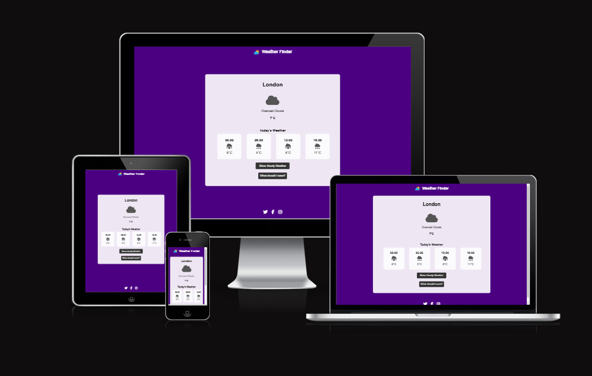
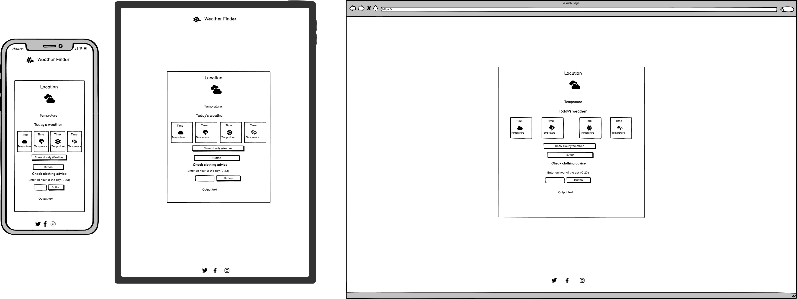
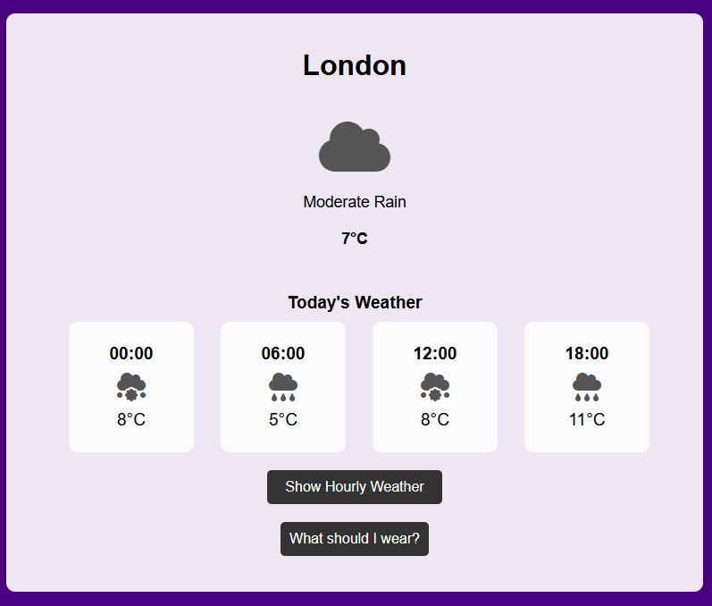
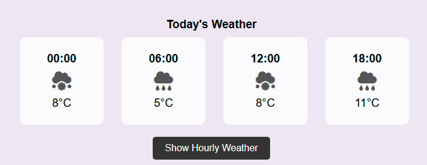
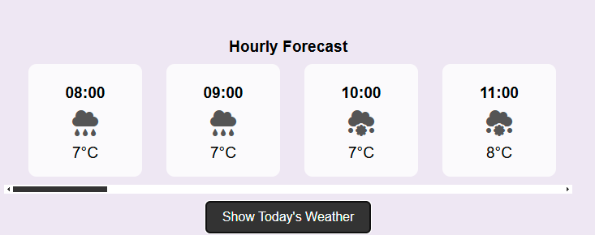
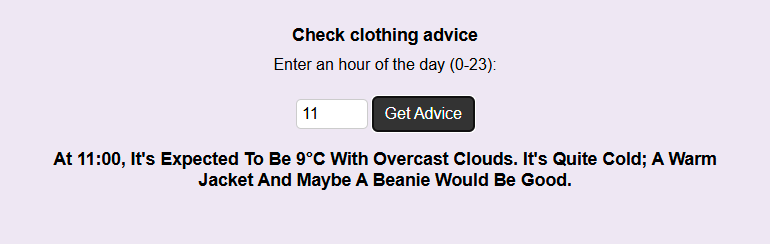
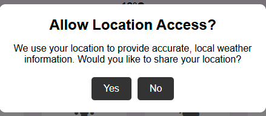

# Weather Finder

Weather Finder is an interactive web application that provides current weather conditions, an hourly weather forecast, and clothing advice based on the forecasted temperature and weather conditions. The application features a responsive design, ensuring an optimal user experience across mobile, tablet, and desktop devices.

[View the project here](https://rand-jelo.github.io/Weather-Webiste/)

---

## Table of Contents

- [User Experience (UX)](#user-experience-ux)
  - [User Stories](#user-stories)
- [Design](#design)
- [Features](#features)
  - [Existing Features](#existing-features)
  - [Features Left to Implement](#features-left-to-implement)
- [Technologies Used](#technologies-used)
- [Frameworks, Libraries & Programs Used](#frameworks-libraries--programs-used)
- [Testing](#testing)
  - [Validation Results](#validation-results)
  - [Manual Testing](#manual-testing)
  - [Lighthouse Report](#lighthouse-report)
- [Deployment and Local Development](#deployment-and-local-development)
  - [GitHub Pages](#github-pages)
  - [Forking the GitHub Repository](#forking-the-github-repository)
  - [Local Clone](#local-clone)
- [Credits](#credits)
- [Acknowledgements](#acknowledgements)

---

## User Experience (UX)

The Weather Finder application aims to deliver accurate weather information and practical advice to users in a simple and user-friendly manner.

### User Stories

- **First-time visitors**
  - Understand the app's purpose and functionality immediately.
  - Quickly access current weather data for their location.
  - Explore the hourly forecast in a visually appealing layout.
  - Receive clothing advice tailored to weather conditions.

- **Returning visitors**
  - Check updated weather information for their location.
  - View changes in the hourly forecast.
  - Use the clothing advice feature regularly.

- **Frequent users**
  - Rely on the app for daily weather updates.
  - Share the application with friends or colleagues seeking similar functionality.

---

## Design

- **Color Scheme**: The app uses a combination of deep purple (#4B0082) and white, providing a clean, modern look.
- **Typography**: Simple, readable fonts are used to ensure clarity.
- **Wireframes**: Wireframes for this project were created using Balsamiq.

    

---

## Features

### Existing Features

1. **Header and Logo**
   - Displays the application title and logo prominently at the top of the page.

      

2. **Weather Card**
   - Displays the current weather, including temperature, conditions, and an icon representing the weather type.
   - Provides an hourly weather forecast with a scrollable layout.

      

3. **Hourly Forecast Toggle**
   - Allows users to toggle between "Today's Highlights" and "Hourly Forecast."
   - Highlights key times (e.g., morning, noon, evening) for easier comprehension.

      

      

4. **Clothing Advice Form**
   - A form where users can input a specific hour to receive clothing advice based on the temperature and weather conditions.

      

 **Modal for Location Access**
   - A popup modal appears when the application loads, asking the user for location access.
   - The modal includes a brief explanation of why location data is needed and offers options to either grant or deny access:
     - **Yes**: Fetches the user's location and retrieves weather data for that location.
     - **No**: Falls back to a default location (London).
   - Enhances the user experience by making location access clear and transparent.

      

6. **Footer**
   - Provides links to social media accounts and serves as a closing element for the page.

     

---

## Features Left to Implement

1. **Weekly Forecast**
   - Expand the application to include a 7-day weather forecast.
2. **Location Search**
   - Add functionality to search for weather information for other locations.
3. **Customizable Themes**
   - Enable users to switch between light and dark modes or select custom color schemes.

---

## Technologies Used

- **HTML5**: For structuring the content.
- **CSS3**: For styling and responsive design.
- **JavaScript (ES6)**: For fetching weather data and dynamic interaction.
- **OpenWeatherMap API**: For real-time weather data.

---

## Frameworks, Libraries & Programs Used

- **Font Awesome**: For weather and social media icons.
- **Git & GitHub**: For version control and deployment.
- **VS Code**: For coding and debugging.
- **Am I Responsive**: To validate the responsiveness of the website.
- **Balsamiq**: Used to create wireframes for layout planning.

---

## Testing

### Validation Results

- **HTML**: Validated using the [W3C Markup Validator](https://validator.w3.org/).
- **CSS**: Validated using the [W3C CSS Validator](https://jigsaw.w3.org/css-validator/).

index.html

style.css

script.js

### Manual Testing

- **Functionality Testing**
  - Tested the geolocation feature to fetch weather data for the user’s current location.
  - Verified the functionality of the toggle button between "Today's Highlights" and "Hourly Forecast."
  - Checked the clothing advice form for input validation and output accuracy.

- **Responsiveness Testing**
  - Ensured proper alignment and scaling of elements on mobile, tablet, and desktop devices.
  - Verified that scrollable hourly forecast works as expected on larger screens.

- **Navigation Testing**
  - Confirmed that all buttons and links function correctly.

### Lighthouse Report

#### Desktop

Desktop report

#### Mobile

Mobile report

---

## Deployment and Local Development

### GitHub Pages

GitHub Pages used to deploy live version of the website.
1. Log in to GitHub and locate [GitHub Repository weather-website](https://github.com/Rand-Jelo/Weather-Webiste)
2. At the top of the Repository locate "Settings" button on the menu.
3. Scroll down the Settings page until you locate "GitHub Pages".
4. Under "Source", click the dropdown menu "None" and select "Main" and click "Save".
5. The page will automatically refresh.
6. Scroll back to locate the now-published site [link](https://rand-jelo.github.io/Weather-Webiste/) in the "GitHub Pages" section.

### Forking the GitHub Repository

By forking the repository, we make a copy of the original repository on our GitHub account to view and change without affecting the original repository by using these steps:

1. Log in to GitHub and locate [GitHub Repository weather-webiste](https://github.com/Rand-Jelo/Weather-Webiste)
2. At the top of the Repository(under the main navigation) locate "Fork" button.
3. Now you should have a copy of the original repository in your GitHub account.

### Local Clone

1. Log in to GitHub and locate [GitHub Repository weather-website](https://github.com/Rand-Jelo/Weather-Webiste)
2. Under the repository name click "Clone or download"
3. Click on the code button, select clone with HTTPS, SSH or GitHub CLI and copy the link shown.
4. Open Git Bash
5. Change the current working directory to the location where you want the cloned directory to be made.
6. Type `git clone` and then paste The URL copied in the step 3.
7. Press Enter and your local clone will be created.

---

## Credits

### Code

- Weather API integration and geolocation features adapted from the [OpenWeatherMap API documentation](https://openweathermap.org/api).
- Scrollbar customization ideas from [MDN Web Docs](https://developer.mozilla.org/).

### Media

- Icons from [Font Awesome](https://fontawesome.com/).

### Tutorials and Resources

- JavaScript tutorials from [JavaScript.info](https://javascript.info/).
- OpenWeatherMap API integration guidance from [YouTube tutorials](https://youtube.com/).

---

## Acknowledgements

- A big thank you to my mentor, Mitko Bachvarov, for his continuous guidance and feedback during this project.
- Special thanks to the Stack Overflow community for their solutions to development challenges.

---